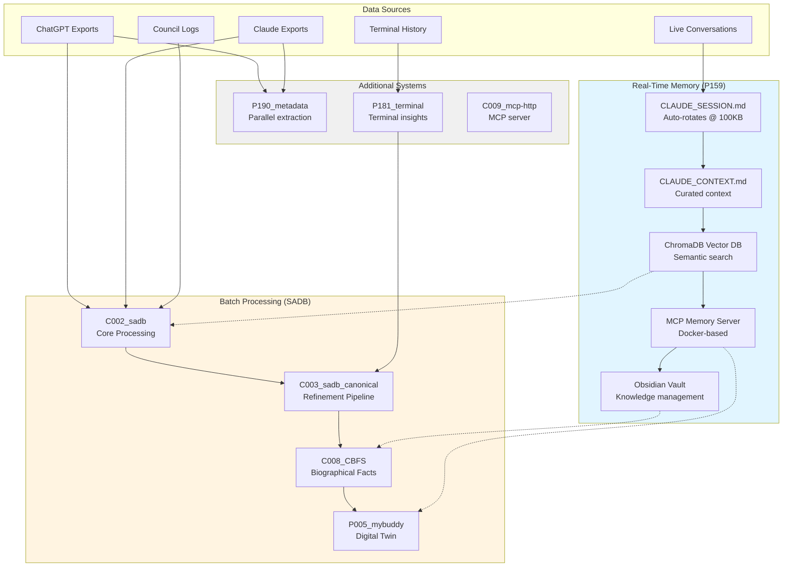
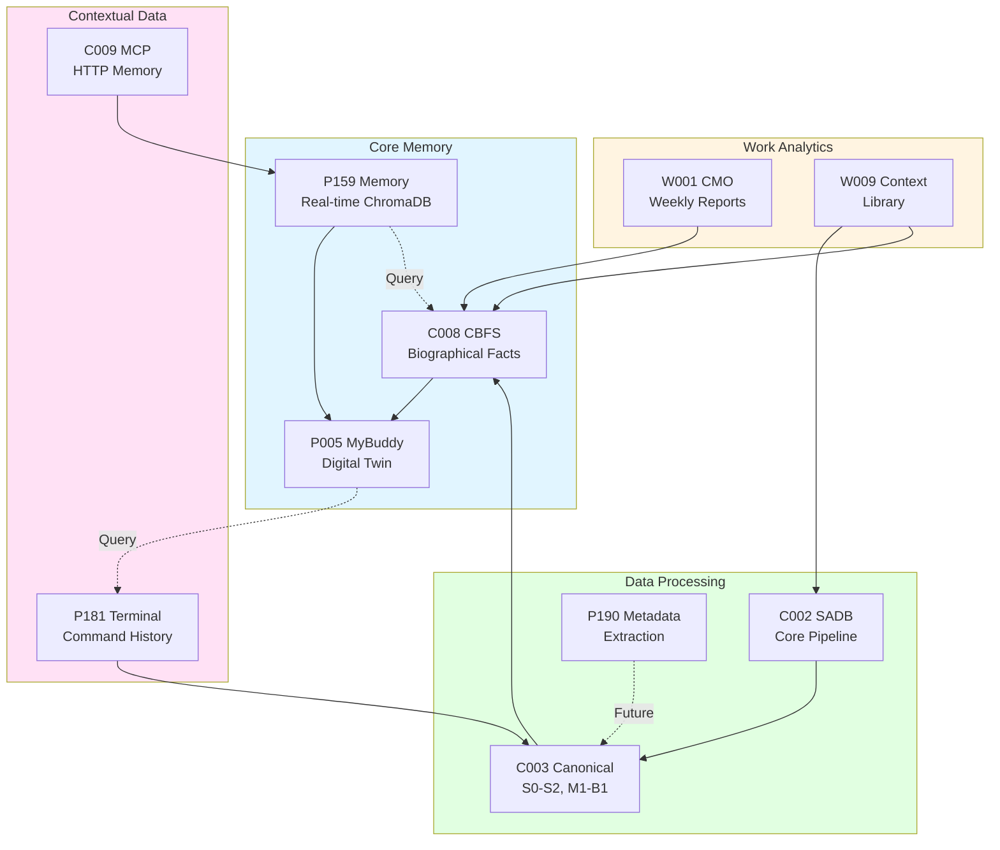
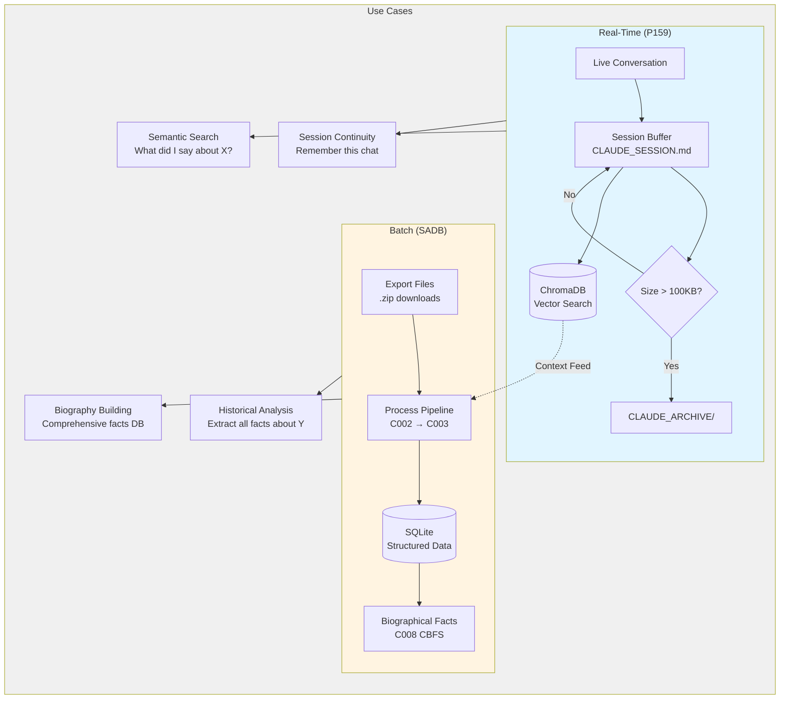
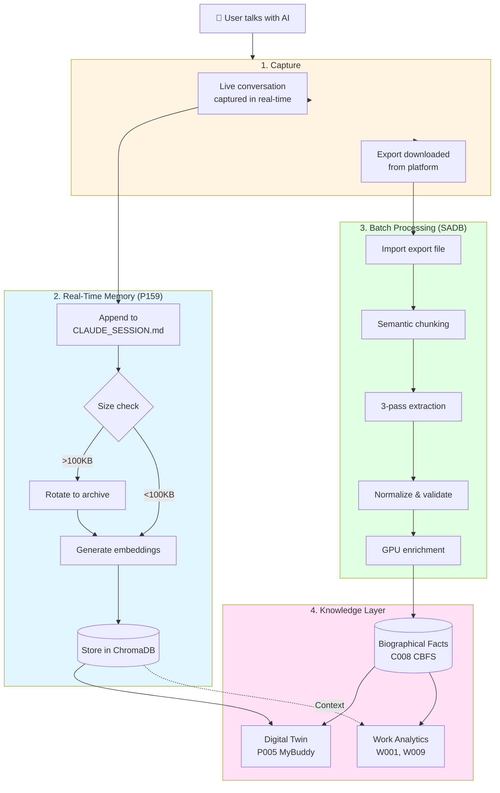

# Memory System Architecture Diagrams

**Visual guide to Jeremy's memory and knowledge systems**

---

## Complete Memory Ecosystem



---

## SADB Pipeline (Detailed Stages)

```mermaid
flowchart LR
    subgraph Input["Raw Data"]
        ChatGPT[ChatGPT<br/>conversations.json]
        Claude[Claude<br/>Exports]
    end

    subgraph C002["C002_sadb (Core)"]
        Chunk[Chunking<br/>1.5k tokens<br/>400 overlap]
        Consensus[3-Pass Consensus<br/>Multi-model agreement]
        Review[Human Review<br/>Web UI/CLI]
        SQLite[(SQLite DB)]
        Twin[twin_feed_v1.ndjson<br/>Facts + Preferences]
    end

    subgraph C003["C003_sadb_canonical (Stages)"]
        S0[S0: Capture<br/>SHA256 dedup<br/>Receipts]
        S1[S1: Normalize<br/>Schema validation<br/>Leak scanning]
        S2[S2: Enrich<br/>BERTopic GPU<br/>70,539 windows]
        M1[M1: Q/A Memory<br/>4,092 pairs]
        U1[U1: Segments<br/>108K utterances]
        J1[J1: Fact Extraction<br/>508 merged facts]
        B1[B1: Braided Timeline<br/>95K events]
    end

    subgraph C008["C008_CBFS"]
        Import[Import from J1]
        YAML[(YAML Database<br/>232 facts)]
        Privacy[Privacy Tiers<br/>Confidence Scores]
    end

    subgraph P005["P005_mybuddy"]
        Chroma[(Chroma Vector DB)]
        RAG[RAG Engine]
        LLM[Local LLMs<br/>via Ollama]
    end

    ChatGPT --> Chunk
    Claude --> Chunk
    Chunk --> Consensus
    Consensus --> Review
    Review --> SQLite
    Review --> Twin

    SQLite --> S0
    S0 --> S1
    S1 --> S2
    S2 --> M1
    M1 --> U1
    U1 --> J1
    S1 --> B1
    J1 --> B1

    J1 --> Import
    Import --> YAML
    YAML --> Privacy

    Twin --> Chroma
    Privacy -.-> Chroma
    Chroma --> RAG
    RAG --> LLM

    style C002 fill:#fff4e1
    style C003 fill:#e1f5ff
    style C008 fill:#e1ffe1
    style P005 fill:#ffe1f5
```



---

## Memory System Integration Points



---

## Real-Time vs Batch Memory



---

## Data Flow: From Conversation to Knowledge



---

## System Dependencies

```mermaid
graph TB
    subgraph External["External Data"]
        ChatGPT[ChatGPT<br/>Platform]
        Claude[Claude<br/>Platform]
        Terminal[Terminal<br/>Shell History]
    end

    subgraph Core["Core Infrastructure (C-series)"]
        C000[C000 Info-Center<br/>🗺️ Standards Hub]
        C001[C001 Mission Control<br/>⚙️ Orchestration]
        C002[C002 SADB Core<br/>💾 Data Ingestion]
        C003[C003 SADB Canonical<br/>🔬 Refinement]
        C008[C008 CBFS<br/>📋 Biographical Facts]
        C009[C009 MCP HTTP<br/>🔌 Memory Server]
        C010[C010 Standards<br/>📜 Schemas]
    end

    subgraph Personal["Personal Projects (P-series)"]
        P005[P005 MyBuddy<br/>🤖 Digital Twin]
        P159[P159 Memory<br/>💭 Real-Time]
        P181[P181 Terminal<br/>💻 Command History]
        P190[P190 Metadata<br/>📊 Extraction]
    end

    subgraph Work["Work Projects (W-series)"]
        W001[W001 CMO<br/>📈 Reporting]
        W009[W009 Context<br/>📚 Library]
    end

    %% External inputs
    ChatGPT --> C002
    ChatGPT --> P190
    Claude --> C002
    Claude --> P190
    Claude --> P159
    Terminal --> P181

    %% Core dependencies
    C000 -.Standards.-> C002
    C000 -.Standards.-> C003
    C001 -.Orchestrates.-> C002
    C002 --> C003
    C003 --> C008
    P181 --> C003

    %% Personal integrations
    C008 --> P005
    C002 --> P005
    P159 --> P005
    C009 --> P159

    %% Work integrations
    C002 --> W001
    C008 --> W001
    C002 --> W009
    C008 --> W009
    P159 -.Context.-> W009

    %% Future integrations
    P190 -.Planned.-> C003

    style Core fill:#e1f5ff
    style Personal fill:#fff4e1
    style Work fill:#e1ffe1
    style External fill:#f0f0f0

    linkStyle 19,20,21,22 stroke:#999,stroke-dasharray:5
```

---

## Legend

**Color Coding:**
- 🔵 Blue: Core Infrastructure (C-series)
- 🟡 Yellow: Personal Projects (P-series)
- 🟢 Green: Data Processing/Refinement
- 🔴 Pink: Knowledge Output/Usage
- ⚪ Gray: External Systems/Context

**Line Styles:**
- Solid line (→): Direct data flow
- Dotted line (-.->): Context/query relationship
- Dashed line (--): Planned/future integration

**System Prefixes:**
- C### = Core infrastructure
- P### = Personal projects
- W### = Work projects

---

*Generated: 2025-11-19*
*Location: C000_info-center/workspace/MEMORY_ARCHITECTURE_DIAGRAMS.md*
